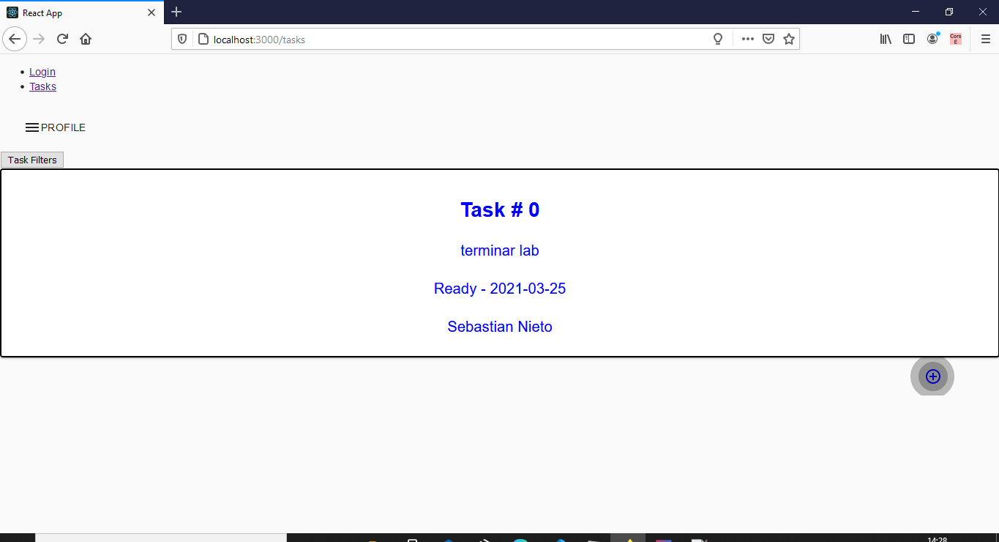
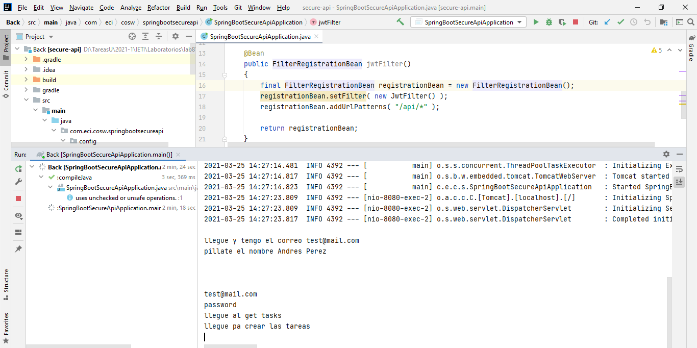

# lab8-IETI

Este laboratorio solo funciona si se ejecuta localmente, para ello debe seguir los siguientes pasos.
1.	Debe dirigirse a la carpeta de Front dentro de ella encontrara otra, ingrese a esa y, desde consola ejecute los siguientes comandos, uno por uno.
     ```
      npm i
      npm init
      npm start
     ```
2.	Luego debe dirigirse al proyecto que está dentro de la carpeta Back, en ella debe ejecutar la clase principal.
3.	Después del primer paso debe esperar a que abra una ventana en su motor predeterminado de búsqueda, si este no es Firefox, por favor copie el link que aparece ahí y colóquelo en Firefox, si por alguna razón no tiene el motor Firefox, descárguelo, el laboratorio solo funciona ahí.
4.	Finalmente, usted vera la vista de Log in, en ella debe ingresar las siguientes credenciales que son la únicas que sirven, ya que están quemadas en código.
   ```
    Username: test@mail.com
  	Password: password
   ```
5.	Después ver la ventana para agregar tareas, en ella simplemente debe dar click en el mas, ahí se desplegará un pop up el cual deberá diligenciar unos campos, luego click en el chulito y esta automáticamente empezara ha desplegar las tareas creadas o existentes.

Prueba 1



Prueba2


